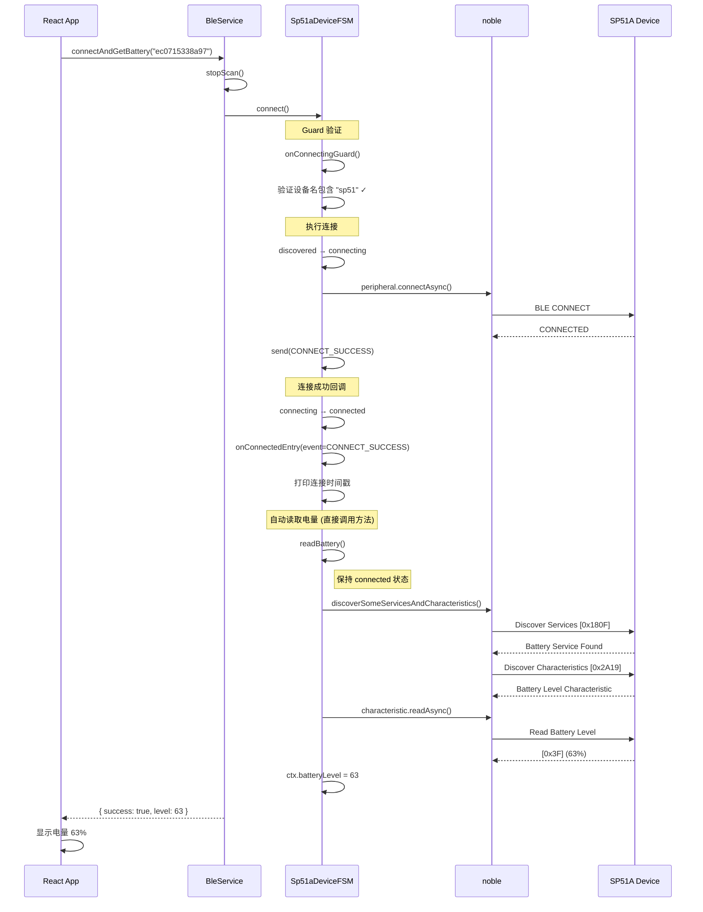

# SP51A 电量读取流程

## 📋 流程概述

SP51A 是一款特定的 BLE 设备，本项目针对其实现了专用的状态机和自动电量读取功能。

## 🎯 SP51A 特性

| 特性     | 说明                           |
| -------- | ------------------------------ |
| 设备名称 | 包含 "SP51A" 或 "sp51"         |
| 电量服务 | Battery Service (UUID: 0x180F) |
| 电量特征 | Battery Level (UUID: 0x2A19)   |
| 自动读取 | 连接成功后自动读取电量         |

## 🔄 电量读取序列图



## 📊 FSM 状态转换

```mermaid
stateDiagram-v2
    [*] --> idle

    idle --> discovered: DISCOVER

    discovered --> connecting: CONNECT
    note right of connecting: Guard: 验证 name 包含 "sp51"

    connecting --> connected: CONNECT_SUCCESS
    note right of connected: Entry: 打印时间 + 调用 readBattery()

    connected --> disconnecting: DISCONNECT
    connected --> discovered: AUTO_DISCONNECT

    disconnecting --> idle: DISCONNECT_DONE
```

> **注意**：`readBattery()` 是在 `connected` 状态下直接调用的方法，不触发状态转换。只有在 `connected` 状态才能调用此方法。

## 🔧 关键代码

### 1. 设备识别

```typescript
// ble.ts - 创建设备特定 FSM
function createDeviceFSM(peripheral: Peripheral): BleDeviceFSM | undefined {
  const name = peripheral.advertisement.localName?.toLowerCase() || ''

  // SP51A 设备使用专用 FSM
  if (name.includes('sp51')) {
    console.log(`[BLE] Creating Sp51aDeviceFSM for ${peripheral.advertisement.localName}`)
    return new Sp51aDeviceFSM(peripheral.id)
  }

  return undefined // 其他设备暂不支持
}
```

### 2. 连接前验证 (Guard)

```typescript
// Sp51aDeviceFSM.ts
protected async onConnectingGuard(ctx: BleDeviceContext): Promise<boolean> {
  // 调用父类验证
  const parentResult = await super.onConnectingGuard(ctx)
  if (!parentResult) return false

  // SP51A 特定验证：确认设备名称
  if (!ctx.deviceName?.toLowerCase().includes('sp51')) {
    ctx.error = 'Not a SP51A device'
    console.warn(`[SP51A] Guard rejected: ${ctx.deviceName}`)
    return false
  }

  console.log(`[SP51A] Guard passed for ${ctx.deviceName}`)
  return true
}
```

### 3. 连接成功处理

```typescript
// Sp51aDeviceFSM.ts
protected async onConnectedEntry(ctx: BleDeviceContext, event: string): Promise<void> {
  await super.onConnectedEntry(ctx, event)

  // 仅在首次连接时执行
  if (event === BleEvents.CONNECT_SUCCESS) {
    // 打印连接时间（用户需求）
    const now = new Date()
    console.log(`[SP51A] ========================================`)
    console.log(`[SP51A] Connected successfully!`)
    console.log(`[SP51A] Device: ${ctx.deviceName}`)
    console.log(`[SP51A] Time: ${now.toLocaleString()}`)
    console.log(`[SP51A] Timestamp: ${now.getTime()}`)
    console.log(`[SP51A] ========================================`)

    // 自动读取电量（直接方法调用，不触发状态转换）
    const level = await this.readBattery()
    if (level !== null) {
      console.log(`[SP51A] Battery level: ${level}% at ${new Date().toLocaleString()}`)
    }
  }
}
```

### 4. 电量读取

```typescript
// BleDeviceFSM.ts - readBattery 方法（只能在 connected 状态调用）
async readBattery(): Promise<number | null> {
  // Guard: 只允许在已连接状态读取
  if (this.getState() !== 'connected') {
    console.warn(`[BLE] Cannot read battery: device is not connected`)
    return null
  }

  const ctx = this.getContext()
  if (!ctx.peripheral) {
    console.warn(`[BLE] Cannot read battery: no peripheral`)
    return null
  }

  try {
    console.log(`[BLE] Reading battery level...`)
    const level = await this.readBatteryLevel(ctx.peripheral)
    this.updateContext({ batteryLevel: level, error: null })
    console.log(`[BLE] Battery level: ${level}%`)
    return level
  } catch (error) {
    const errorMsg = error instanceof Error ? error.message : String(error)
    this.updateContext({ error: errorMsg })
    console.error(`[BLE] Read battery failed:`, errorMsg)
    return null
  }
}

// readBatteryLevel - 底层 BLE 读取方法
protected async readBatteryLevel(peripheral: Peripheral): Promise<number> {
  // 发现 Battery Service 和 Battery Level Characteristic
  const { characteristics } = await peripheral.discoverSomeServicesAndCharacteristicsAsync(
    [BATTERY_SERVICE_UUID],        // 0x180F
    [BATTERY_LEVEL_CHARACTERISTIC_UUID]  // 0x2A19
  )

  const batteryChar = characteristics.find(
    c => c.uuid === BATTERY_LEVEL_CHARACTERISTIC_UUID
  )

  if (!batteryChar) {
    throw new Error('Battery characteristic not found')
  }

  // 读取电量值（单字节 0-100）
  const data = await batteryChar.readAsync()
  return data[0]
}
```

## 📝 BLE 协议细节

### Battery Service (0x180F)

```
Service UUID: 0x180F (Battery Service)
├── Characteristic UUID: 0x2A19 (Battery Level)
│   ├── Properties: Read, Notify
│   └── Value: uint8 (0-100, 百分比)
```

### 读取流程

1. **发现服务**：`discoverSomeServicesAndCharacteristicsAsync([0x180F], [0x2A19])`
2. **读取特征**：`characteristic.readAsync()` → `Buffer [0x3F]`
3. **解析数据**：`data[0]` = 63 (0x3F = 63%)

## 📊 日志输出示例

```
[SP51A] Guard passed for SP51A
[FSM] discovered --CONNECT--> connecting
[FSM] Entry: connecting
[BLE] Connecting to SP51A...
[BLE] Connected to SP51A
[FSM] Transition in progress, queuing event: CONNECT_SUCCESS
[FSM] Processing pending event: CONNECT_SUCCESS
[FSM] connecting --CONNECT_SUCCESS--> connected
[FSM] Entry: connected
[BLE] Now connected to SP51A
[SP51A] ========================================
[SP51A] Connected successfully!
[SP51A] Device: SP51A
[SP51A] Time: 2026/1/6 11:33:44
[SP51A] Timestamp: 1767670424368
[SP51A] ========================================
[BLE] Reading battery level...
[BLE] Battery level: 63%
[SP51A] Battery level: 63% at 2026/1/6 11:33:45
```

## ⚠️ 注意事项

1. **状态检查**：`readBattery()` 内置状态检查，只有在 `connected` 状态才能调用
2. **无状态转换**：`readBattery()` 是直接方法调用，不触发状态转换，简化了状态流程
3. **等待时间**：`connectAndGetBattery` 需等待让 FSM 完成连接和读取

## 🔗 相关文档

- [FSM 状态机模块](../模块分析/FSM状态机模块.md)
- [设备扫描与连接流程](./设备扫描与连接流程.md)
