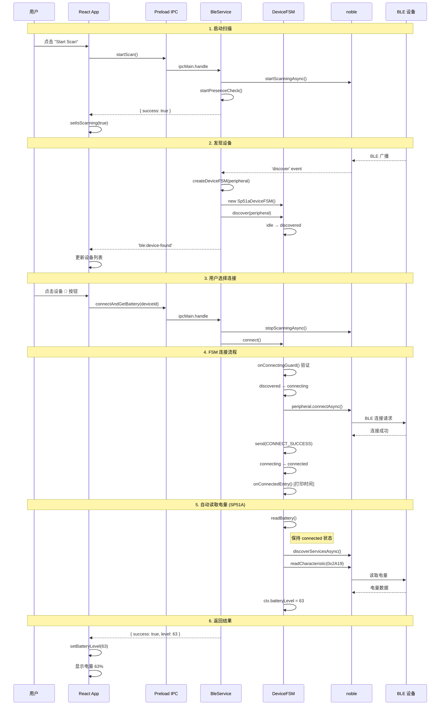
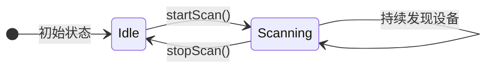
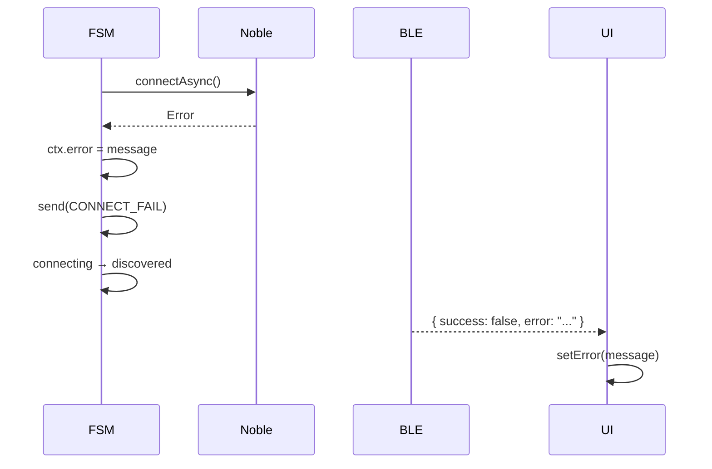
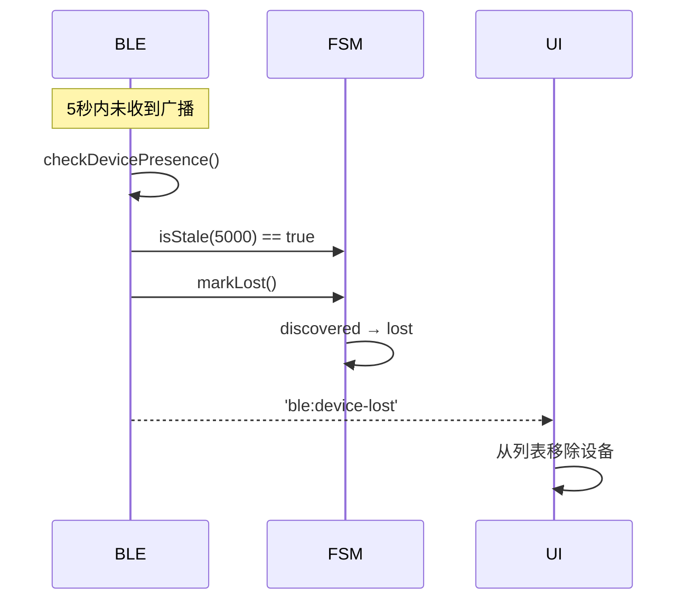
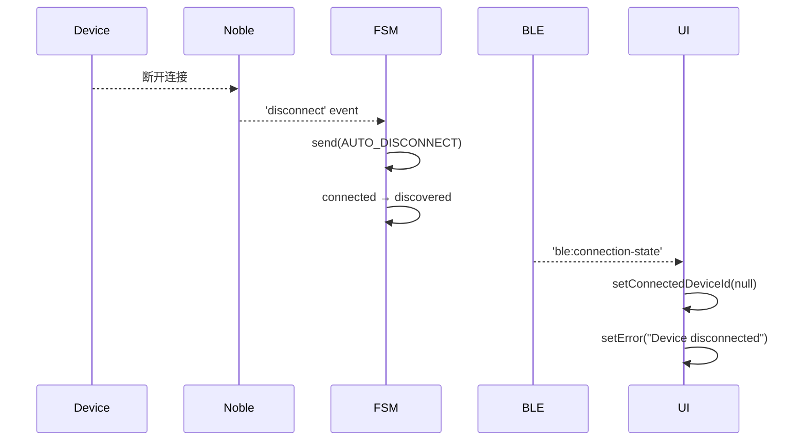

# 设备扫描与连接流程

## 📋 流程概述

本文档描述用户从启动扫描到成功连接 BLE 设备的完整流程。

## 🔄 完整流程图



## 📊 状态转换详解

### 扫描阶段



### 设备 FSM 状态

                    ┌─────────────────┐
                    │   Not Found     │
                    └────────┬────────┘
                             │ discover
                             ▼
         ┌──────────► ┌──────────────┐ ◄───────────┐
         │            │  Discovered  │             │
         │ timeout    └──────┬───────┘  disconnect │
         │                   │ connect             │
         │                   ▼                     │
         │            ┌─────────────┐              │
    ┌────┴────┐       │ Connecting  │              │
    │  Lost   │       └──────┬──────┘              │
    └─────────┘              │ success             │
                             ▼                     │
                      ┌─────────────┐              │
                      │  Connected  │──────────────┘
                      └─────────────┘   auto-disconnect

状态转换: discovered → connecting → connected

          discovered                    connecting                    connected
              │                             │                             │
    ┌─────────┼─────────┐          ┌────────┼────────┐          ┌─────────┼─────────┐
    │  exit   │  guard  │          │ entry  │  exit  │          │  entry  │         │
    │(async)  │ (async) │          │(async) │(async) │          │ (async) │         │
    └─────────┼─────────┘          └────────┼────────┘          └─────────┼─────────┘
              │                             │                             │
              └─────────► CONNECT ─────────►└─────────► SUCCESS ─────────►│
                          ↑                              ↑
                     pre: 停止扫描                  post: 注册断开监听
                     pre: 检查蓝牙状态              post: 读取电量

```mermaid
stateDiagram-v2
    [*] --> idle

    idle --> discovered: DISCOVER
    note right of discovered: 记录设备信息\n更新 lastSeen

    discovered --> connecting: CONNECT
    note right of connecting: Guard: 验证设备\n Entry: 执行连接

    connecting --> connected: CONNECT_SUCCESS
    connecting --> discovered: CONNECT_FAIL
    note right of connected: Entry: 打印时间\n readBattery() 可调用

    connected --> disconnecting: DISCONNECT
    connected --> discovered: AUTO_DISCONNECT

    disconnecting --> idle: DISCONNECT_DONE
```

> **注意**：`readBattery()` 是在 `connected` 状态下直接调用的方法，不触发状态转换。

## 🔧 关键代码路径

### 1. 启动扫描

```typescript
// UI (App.tsx)
const handleStartScan = async () => {
  const result = await window.ble.startScan()
  if (result.success) setIsScanning(true)
}

// BleService (ble.ts)
async startScan(): Promise<ScanResult> {
  await noble.startScanningAsync([], true)  // 允许重复
  this.startPresenceCheck()                  // 启动存在性检测
  return { success: true }
}
```

### 2. 设备发现

```typescript
// BleService
noble.on('discover', (peripheral) => {
  // 创建/获取 FSM
  let fsm = this.deviceFSMs.get(peripheral.id)
  if (!fsm) {
    fsm = createDeviceFSM(peripheral) // 返回 Sp51aDeviceFSM 或 undefined
    if (fsm) this.deviceFSMs.set(peripheral.id, fsm)
  }

  // 触发 DISCOVER 事件
  fsm?.discover(peripheral)

  // 通知 UI
  this.mainWindow?.webContents.send('ble:device-found', {
    id: peripheral.id,
    name: peripheral.advertisement.localName || 'Unknown',
    rssi: peripheral.rssi,
    connectable: peripheral.connectable
  })
})
```

### 3. 连接与读取

```typescript
// BleService
async connectAndGetBattery(deviceId: string): Promise<BatteryResult> {
  const fsm = this.deviceFSMs.get(deviceId)

  // 停止扫描
  await noble.stopScanningAsync()

  // 连接 (SP51A 会在 onConnectedEntry 中自动 readBattery)
  const connectSuccess = await fsm.connect()

  // 等待电量读取完成
  await new Promise(r => setTimeout(r, 500))

  const ctx = fsm.getContext()
  return {
    success: ctx.batteryLevel !== null,
    level: ctx.batteryLevel ?? undefined
  }
}
```

### 4. SP51A 自动读取电量

```typescript
// Sp51aDeviceFSM
protected async onConnectedEntry(ctx, event): Promise<void> {
  await super.onConnectedEntry(ctx, event)

  // 仅在首次连接时自动读取
  if (event === BleEvents.CONNECT_SUCCESS) {
    console.log(`[SP51A] Connected at ${new Date().toLocaleString()}`)
    await this.readBattery()  // 触发 READ_BATTERY
  }
}
```

## ⚠️ 错误处理

### 连接失败



### 设备丢失



### 自动断开



## 📝 配置参数

| 参数                    | 值     | 说明              |
| ----------------------- | ------ | ----------------- |
| `DEVICE_LOST_TIMEOUT`   | 5000ms | 设备消失判定时间  |
| `DEVICE_CHECK_INTERVAL` | 1000ms | 存在性检测间隔    |
| 电量读取等待            | 500ms  | 等待 FSM 完成读取 |

## 🔗 相关文档

- [FSM 状态机模块](../模块分析/FSM状态机模块.md)
- [BLE 服务模块](../模块分析/BLE服务模块.md)
- [SP51A 电量读取流程](./SP51A电量读取流程.md)
