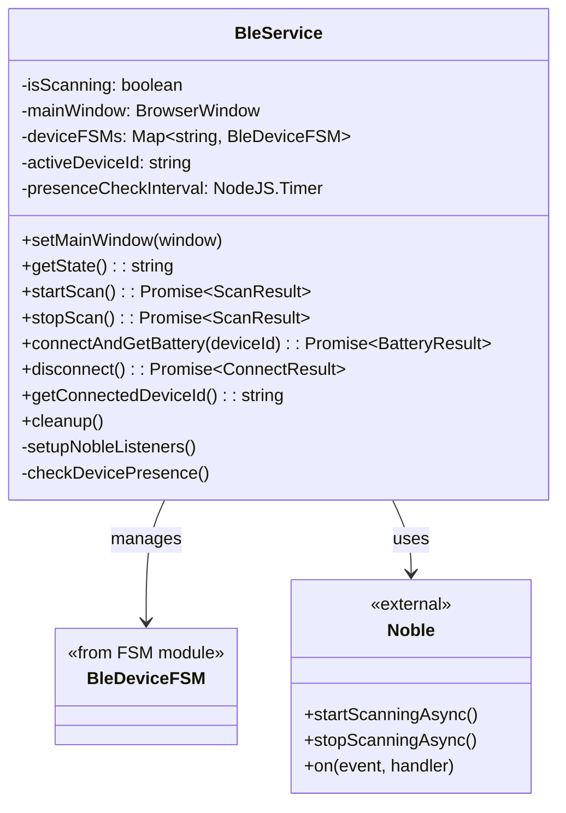
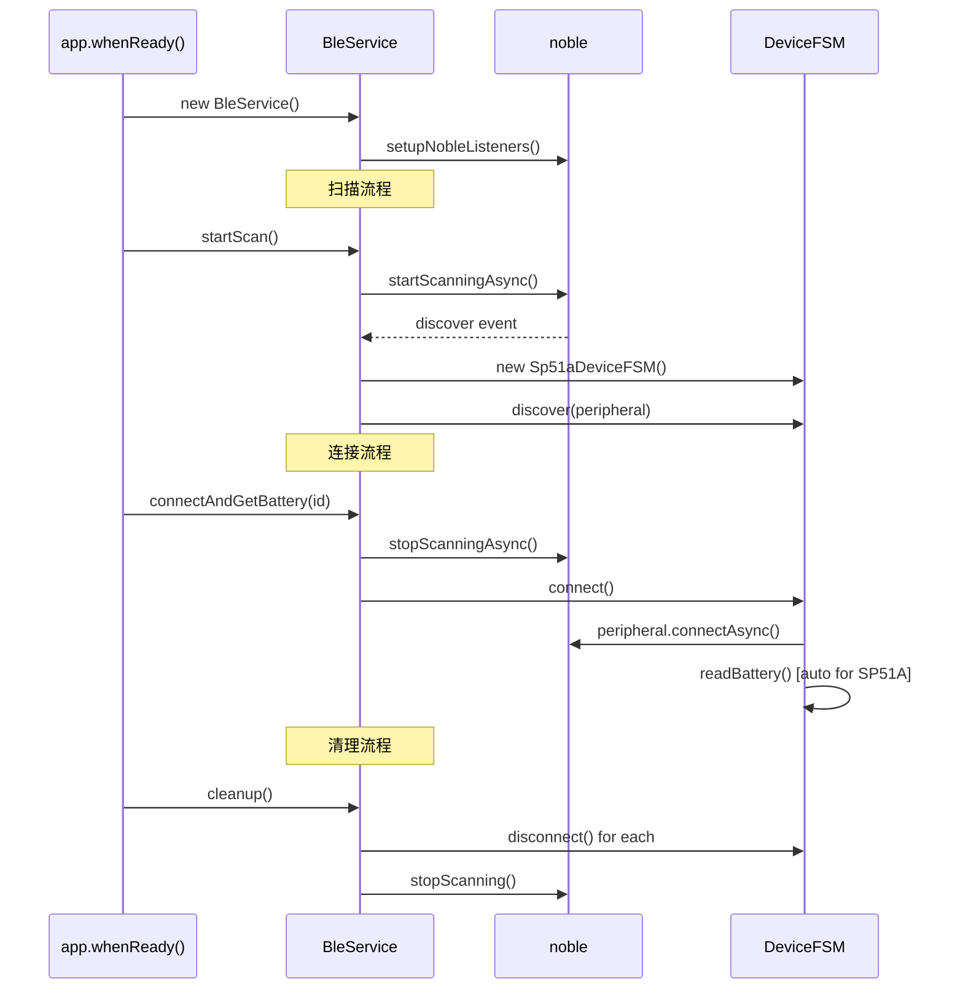

# BLE 服务模块

## 📋 模块概述

BLE 服务模块是主进程中负责蓝牙低功耗设备通信的核心服务层，封装了 Noble 库的底层操作，并整合 FSM 进行状态管理。

**路径**：`src/main/ble.ts`

## 🎯 职责

1. 管理 BLE 适配器状态
2. 执行设备扫描
3. 管理设备 FSM 实例
4. 与渲染进程通信（IPC）
5. 设备存在性检测

## 🏗 类结构



## 📊 数据流

```mermaid
flowchart LR
    subgraph Renderer
        App[React App]
    end

    subgraph Preload
        IPC[bleApi]
    end

    subgraph Main
        Handlers[IPC Handlers]
        BLE[BleService]
        FSM[Device FSMs]
    end

    subgraph External
        Noble[@stoprocent/noble]
        Device[BLE Device]
    end

    App -->|startScan| IPC
    IPC -->|invoke| Handlers
    Handlers -->|call| BLE
    BLE -->|create/manage| FSM
    BLE -->|scan/connect| Noble
    Noble <-->|BLE protocol| Device

    BLE -.->|device-found| Handlers
    Handlers -.->|send| IPC
    IPC -.->|callback| App
```

## 🔧 核心功能

### 1. 蓝牙状态管理

```typescript
// 监听蓝牙适配器状态
noble.on('stateChange', (state) => {
  this.mainWindow?.webContents.send('ble:state-change', state)
})

// 获取当前状态
getState(): string {
  return noble.state
}
```

### 2. 设备扫描

```typescript
async startScan(): Promise<ScanResult> {
  // 启动扫描（允许重复发现以更新 RSSI）
  await noble.startScanningAsync([], true)

  // 启动设备存在性检测
  this.startPresenceCheck()
}
```

### 3. 设备发现与 FSM 创建

```typescript
noble.on('discover', (peripheral) => {
  let fsm = this.deviceFSMs.get(peripheral.id)

  if (!fsm) {
    // 创建设备特定的 FSM
    fsm = createDeviceFSM(peripheral) // SP51A → Sp51aDeviceFSM
    if (fsm) {
      this.deviceFSMs.set(peripheral.id, fsm)
      // 监听状态变化
      fsm.subscribe(this.handleFsmStateChange)
    }
  }

  // 触发发现事件
  fsm.discover(peripheral)

  // 通知渲染进程
  this.mainWindow?.webContents.send('ble:device-found', deviceInfo)
})
```

### 4. 连接与电量读取

```typescript
async connectAndGetBattery(deviceId: string): Promise<BatteryResult> {
  const fsm = this.deviceFSMs.get(deviceId)

  // 如果已连接，直接读取电量
  if (fsm.getState() === 'connected') {
    await fsm.readBattery()
    return { success: true, level: fsm.getContext().batteryLevel }
  }

  // 连接设备（SP51A 会自动读取电量）
  await fsm.connect()

  // 等待电量读取完成
  await new Promise(resolve => setTimeout(resolve, 500))

  return {
    success: ctx.batteryLevel !== null,
    level: ctx.batteryLevel
  }
}
```

### 5. 设备存在性检测

检测设备是否仍在广播（防止 UI 显示已消失的设备）：

```typescript
private checkDevicePresence(): void {
  for (const [id, fsm] of this.deviceFSMs) {
    // 5 秒未收到广播则标记为丢失
    if (fsm.isStale(DEVICE_LOST_TIMEOUT)) {
      fsm.markLost()
      this.mainWindow?.webContents.send('ble:device-lost', { deviceId: id })
    }
  }
}
```

## 📡 IPC 接口

| 方法 | 类型 | 说明 |
|------|------|------|
| `ble:get-state` | invoke | 获取蓝牙状态 |
| `ble:start-scan` | invoke | 开始扫描 |
| `ble:stop-scan` | invoke | 停止扫描 |
| `ble:connect-and-get-battery` | invoke | 连接并读取电量 |
| `ble:disconnect` | invoke | 断开连接 |
| `ble:get-connected-device-id` | invoke | 获取已连接设备 ID |
| `ble:device-found` | send | 发现设备通知 |
| `ble:device-lost` | send | 设备丢失通知 |
| `ble:state-change` | send | 蓝牙状态变化 |
| `ble:connection-state` | send | 连接状态变化 |

## 🔄 生命周期



## 📝 配置常量

```typescript
// 设备消失超时（毫秒）
const DEVICE_LOST_TIMEOUT = 5000

// 存在性检测间隔（毫秒）
const DEVICE_CHECK_INTERVAL = 1000
```

## 🔗 相关文档

- [FSM 状态机模块](./FSM状态机模块.md)
- [渲染层模块](./渲染层模块.md)
- [设备扫描与连接流程](../业务流程/设备扫描与连接流程.md)


