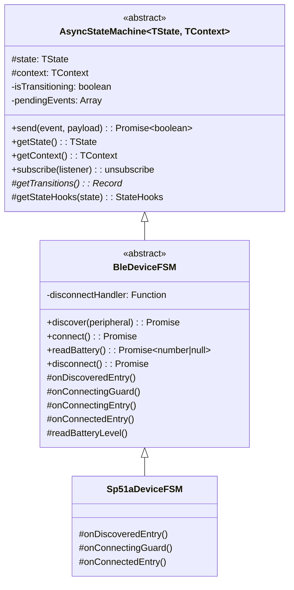
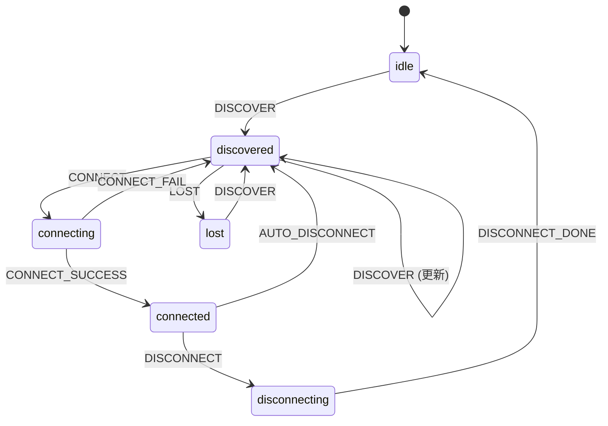
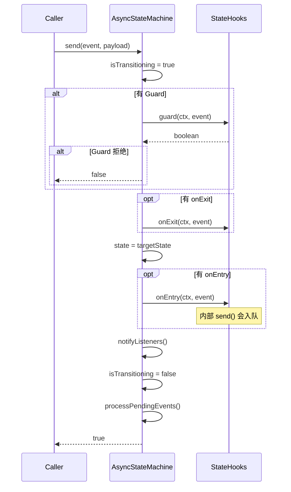

# FSM 状态机模块

## 📋 模块概述

FSM（Finite State Machine）模块提供了一个通用的异步状态机基础架构，专门用于管理 BLE 设备的连接生命周期。

**路径**：`src/main/fsm/`

## 🎯 设计目标

1. 管理 BLE 设备的复杂状态转换
2. 支持异步 Guard/Entry/Exit 钩子
3. 解决嵌套 `send()` 调用的死锁问题
4. 提供可扩展的设备特定行为

## 📁 文件结构

```
src/main/fsm/
├── AsyncStateMachine.ts    # 通用异步状态机基类
├── BleDeviceFSM.ts         # BLE 设备状态机（抽象类）
├── Sp51aDeviceFSM.ts       # SP51A 设备具体实现
└── index.ts                # 模块导出
```

## 🏗 类层次结构



## 📊 状态图



> **注意**：`readBattery()` 是在 `connected` 状态下直接调用的方法，不触发状态转换。

## 🔧 核心组件

### 1. AsyncStateMachine (基类)

通用的异步状态机，支持：

| 特性     | 说明                                  |
| -------- | ------------------------------------- |
| 异步钩子 | guard/onEntry/onExit 支持 async/await |
| 事件队列 | 转换中的事件自动入队，避免死锁        |
| 状态订阅 | 支持监听状态变化                      |
| 类型安全 | 完整的泛型支持                        |

**核心方法**：

```typescript
// 发送事件触发转换
async send(event: string, payload?: unknown): Promise<boolean>

// 获取当前状态
getState(): TState

// 获取上下文
getContext(): TContext

// 订阅状态变化
subscribe(listener: StateChangeListener): () => void
```

### 2. BleDeviceFSM (抽象基类)

定义 BLE 设备通用状态和转换：

**状态定义**：

```typescript
type BleDeviceState =
  | 'idle' // 空闲
  | 'discovered' // 已发现
  | 'connecting' // 连接中
  | 'connected' // 已连接
  | 'disconnecting' // 断开中
  | 'lost' // 已丢失
```

**上下文结构**：

```typescript
interface BleDeviceContext {
  deviceId: string | null
  deviceName: string | null
  peripheral: Peripheral | null
  batteryLevel: number | null
  lastSeen: number
  error: string | null
}
```

**可重写钩子**：

| 钩子                   | 触发时机   | 用途         |
| ---------------------- | ---------- | ------------ |
| `onDiscoveredEntry`    | 设备被发现 | 记录设备信息 |
| `onConnectingGuard`    | 连接前检查 | 验证连接条件 |
| `onConnectingEntry`    | 开始连接   | 执行连接操作 |
| `onConnectedEntry`     | 连接成功   | 后续初始化   |
| `onDisconnectingEntry` | 开始断开   | 执行断开     |
| `onLostEntry`          | 设备丢失   | 清理资源     |

**直接方法**（不触发状态转换）：

| 方法            | 状态要求    | 用途                            |
| --------------- | ----------- | ------------------------------- |
| `readBattery()` | `connected` | 读取电量，返回 `number \| null` |

### 3. Sp51aDeviceFSM (具体实现)

SP51A 设备特定逻辑：

```typescript
class Sp51aDeviceFSM extends BleDeviceFSM {
  // 验证设备名称包含 "sp51"
  protected async onConnectingGuard(ctx): Promise<boolean>

  // 连接成功时打印时间戳，自动读取电量
  protected async onConnectedEntry(ctx, event): Promise<void>
}
```

## ⚙️ 关键机制

### 事件队列（解决死锁）

当 `onEntry` 钩子内部调用 `send()` 时，如果直接执行会导致死锁。解决方案：

```typescript
async send(event: string, payload?: unknown): Promise<boolean> {
  // 如果正在转换中，将事件入队
  if (this.isTransitioning) {
    this.pendingEvents.push({ event, payload })
    return true  // 立即返回，避免阻塞
  }
  return this.processEvent(event, payload)
}

// 转换完成后处理队列
finally {
  this.isTransitioning = false
  await this.processPendingEvents()
}
```

### 转换流程



## 📝 使用示例

```typescript
// 创建设备 FSM
const fsm = new Sp51aDeviceFSM(deviceId)

// 订阅状态变化
fsm.subscribe((prev, next, event, ctx) => {
  console.log(`${prev} -> ${next} via ${event}`)
})

// 发现设备
await fsm.discover(peripheral)

// 连接设备
await fsm.connect() // SP51A 会在 onConnectedEntry 中自动读取电量

// 手动读取电量（只能在 connected 状态调用）
const level = await fsm.readBattery() // 返回 number | null
if (level !== null) {
  console.log(`Battery: ${level}%`)
}

// 断开连接
await fsm.disconnect()
```

## 🔗 相关文档

- [BLE 服务模块](./BLE服务模块.md)
- [设备扫描与连接流程](../业务流程/设备扫描与连接流程.md)
