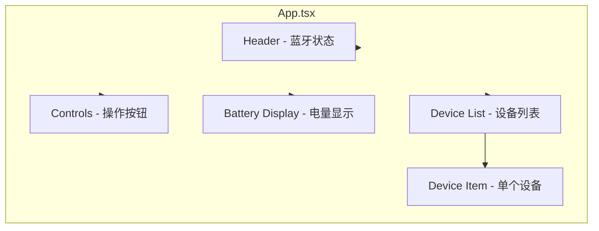

# 渲染层模块

## 📋 模块概述

渲染层模块使用 React 构建用户界面，通过预加载脚本暴露的 `window.ble` API 与主进程通信。

**路径**：`src/renderer/src/`

## 🎯 职责

1. 显示 BLE 适配器状态
2. 展示发现的设备列表
3. 触发扫描/连接/断开操作
4. 显示电量信息

## 📁 文件结构

```
src/renderer/
├── index.html              # HTML 入口
└── src/
    ├── main.tsx            # React 入口
    ├── App.tsx             # 主应用组件
    ├── env.d.ts            # 类型声明
    └── assets/
        ├── base.css        # 基础样式
        └── main.css        # 主样式
```

## 🏗 组件结构



## 📊 状态管理

使用 React Hooks 管理本地状态：

```typescript
// 蓝牙适配器状态
const [bleState, setBleState] = useState<string>('unknown')

// 扫描状态
const [isScanning, setIsScanning] = useState(false)

// 发现的设备 (Map 按 ID 存储)
const [devices, setDevices] = useState<Map<string, BleDevice>>(new Map())

// 错误信息
const [error, setError] = useState<string | null>(null)

// 电量
const [batteryLevel, setBatteryLevel] = useState<number | null>(null)

// 操作状态
const [isGettingBattery, setIsGettingBattery] = useState(false)
const [isDisconnecting, setIsDisconnecting] = useState(false)

// 选中/连接的设备
const [selectedDeviceId, setSelectedDeviceId] = useState<string | null>(null)
const [connectedDeviceId, setConnectedDeviceId] = useState<string | null>(null)
```

## 🔧 核心功能

### 1. 事件监听初始化

```typescript
useEffect(() => {
  // 获取初始状态
  window.ble.getState().then(setBleState)

  // 监听蓝牙状态变化
  const removeStateListener = window.ble.onStateChange(setBleState)

  // 监听设备发现
  const removeDeviceListener = window.ble.onDeviceFound((device) => {
    setDevices(prev => new Map(prev).set(device.id, device))
  })

  // 监听设备丢失
  const removeDeviceLostListener = window.ble.onDeviceLost((event) => {
    setDevices(prev => {
      const newMap = new Map(prev)
      newMap.delete(event.deviceId)
      return newMap
    })
  })

  // 监听连接状态
  const removeConnectionListener = window.ble.onConnectionStateChange((state) => {
    setConnectedDeviceId(state.connected ? state.deviceId : null)
    if (!state.connected && state.reason) {
      setError(`Device disconnected: ${state.reason}`)
    }
  })

  return () => {
    // 清理所有监听器
    removeStateListener()
    removeDeviceListener()
    removeDeviceLostListener()
    removeConnectionListener()
  }
}, [])
```

### 2. 扫描操作

```typescript
const handleStartScan = useCallback(async () => {
  setError(null)
  setDevices(new Map())  // 清空旧设备

  const result = await window.ble.startScan()
  if (result.success) {
    setIsScanning(true)
  } else {
    setError(result.error || 'Failed to start scanning')
  }
}, [])

const handleStopScan = useCallback(async () => {
  await window.ble.stopScan()
  setIsScanning(false)
}, [])
```

### 3. 连接与电量读取

```typescript
const handleConnectAndGetBattery = useCallback(async (deviceId: string) => {
  setError(null)
  setIsGettingBattery(true)
  setSelectedDeviceId(deviceId)
  setBatteryLevel(null)

  try {
    const result = await window.ble.connectAndGetBattery(deviceId)
    if (result.success && result.level !== undefined) {
      setBatteryLevel(result.level)
    } else {
      setError(result.error || 'Failed to get battery')
    }
  } catch (err) {
    setError(String(err))
  } finally {
    setIsGettingBattery(false)
  }
}, [])
```

### 4. 断开连接

```typescript
const handleDisconnect = useCallback(async () => {
  setError(null)
  setIsDisconnecting(true)

  try {
    const result = await window.ble.disconnect()
    if (result.success) {
      setBatteryLevel(null)
      setSelectedDeviceId(null)
    } else {
      setError(result.error || 'Failed to disconnect')
    }
  } finally {
    setIsDisconnecting(false)
  }
}, [])
```

## 🎨 UI 组件

### Header - 蓝牙状态

显示蓝牙适配器当前状态：

```tsx
<header className="header">
  <h1>BLE Scanner</h1>
  <div className="ble-status">
    <span className="status-dot" style={{ backgroundColor: getStateColor(bleState) }} />
    <span>{getStateText(bleState)}</span>
  </div>
</header>
```

状态颜色映射：
| 状态 | 颜色 |
|------|------|
| poweredOn | 绿色 #4ade80 |
| poweredOff | 红色 #f87171 |
| 其他 | 黄色 #fbbf24 |

### Controls - 操作按钮

```tsx
<div className="button-group">
  <button onClick={isScanning ? handleStopScan : handleStartScan}>
    {isScanning ? 'Stop Scanning' : 'Start Scan'}
  </button>
  <button onClick={handleDisconnect} disabled={!connectedDeviceId}>
    🔌 Disconnect
  </button>
</div>
```

### Battery Display - 电量显示

```tsx
{batteryLevel !== null && (
  <div className="battery-display">
    <div className="battery-icon">
      <div className="battery-fill" style={{
        width: `${batteryLevel}%`,
        backgroundColor: batteryLevel > 50 ? '#4ade80' :
                        batteryLevel > 20 ? '#fbbf24' : '#f87171'
      }} />
    </div>
    <span>{batteryLevel}%</span>
  </div>
)}
```

### Device List - 设备列表

按信号强度排序：

```tsx
const sortedDevices = Array.from(devices.values())
  .sort((a, b) => b.rssi - a.rssi)

{sortedDevices.map(device => (
  <li key={device.id} className={device.name.includes('sp51a') ? 'sp51a-device' : ''}>
    <div className="device-info">
      <span>{device.name}</span>
      {isSp51a && <span className="sp51a-badge">SP51A</span>}
    </div>
    <div className="device-meta">
      <span style={{ color: rssiColor }}>{device.rssi} dBm</span>
      <button onClick={() => handleConnectAndGetBattery(device.id)}>
        {connectedDeviceId === device.id ? '🔄' : '🔋'}
      </button>
    </div>
  </li>
))}
```

## 📡 BLE API 接口

通过 `window.ble` 暴露的 API：

```typescript
interface BleApi {
  // 获取蓝牙状态
  getState: () => Promise<string>

  // 扫描控制
  startScan: () => Promise<ScanResult>
  stopScan: () => Promise<ScanResult>

  // 连接操作
  connectAndGetBattery: (deviceId: string) => Promise<BatteryResult>
  disconnect: () => Promise<ConnectResult>
  getConnectedDeviceId: () => Promise<string | null>

  // 事件监听
  onDeviceFound: (callback) => () => void
  onDeviceLost: (callback) => () => void
  onStateChange: (callback) => () => void
  onConnectionStateChange: (callback) => () => void
}
```

## 🎨 样式主题

- **背景**：深色主题
- **主色调**：蓝色系
- **SP51A 设备**：特殊高亮显示
- **信号强度**：根据 RSSI 值显示不同颜色

## 🔗 相关文档

- [BLE 服务模块](./BLE服务模块.md)
- [设备扫描与连接流程](../业务流程/设备扫描与连接流程.md)


